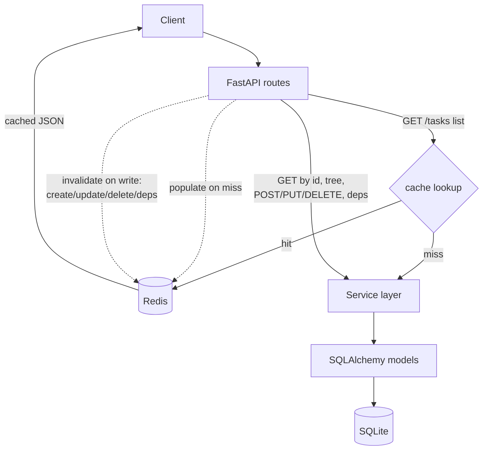

```mermaid
flowchart TD
    A[Client] --> B[FastAPI routes]

    B -->|GET /tasks list| G{cache lookup}
    G -->|hit| C[(Redis)]
    C -->|cached JSON| A
    G -->|miss| D[Service layer]
    B -.->|populate on miss| C

    B -->|GET by id, tree,\nPOST/PUT/DELETE, deps| D

    D --> E[SQLAlchemy models]
    E --> F[(SQLite)]

    B -.->|invalidate on write:\ncreate/update/delete/deps| C
```
