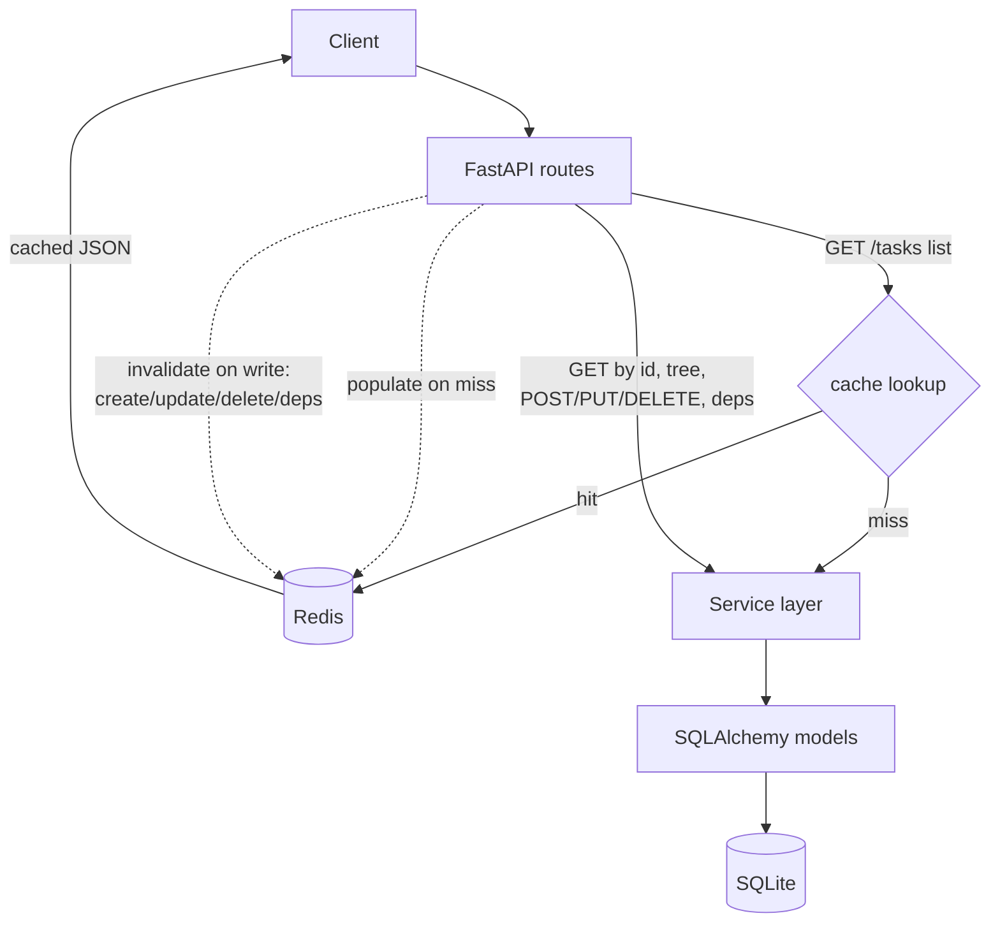

# Design choices
I decided to choose prompting over a sklearn classifier for priority recommendation in Schemas because a sklearn classifier needs labeled trianing examples, but currently there is no historical task data with priority labels.

## Challenges and Solutions
Halfway through the tasks for backend development track, I realized that I was more familiar and comfortable with the assignment details associated with the ai/llm development track, as I had more experiences implementing RAG pipelines than I have with CRUD API building. Although I have already spent around two hours on the previous track, I have another two hours left on the time limit, enough for me to implement the ai/llm tasks on top of the CRUD API layer I already have. I have left previous commit history for viewing.
